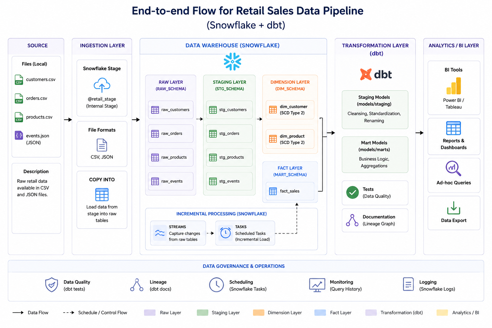

# 🏬 Retail Sales Data Pipeline using Snowflake & dbt

## 📌 Project Overview

This project demonstrates an end-to-end modern Data Engineering pipeline built using Snowflake and dbt for retail sales analytics.

The pipeline ingests CSV and JSON datasets into Snowflake, performs transformations using dbt staging and marts models, implements incremental processing using Streams & Tasks, and generates analytics-ready fact and dimension tables.

---
## System Architecture



---

# 🚀 Tech Stack

- Snowflake
- dbt (Data Build Tool)
- SQL
- CSV / JSON
- Git & GitHub

---

# 📂 Project Structure

```bash
retail-snowflake-dbt-project/
│
├── datasets/
│   ├── customers.csv
│   ├── orders.csv
│   ├── products.csv
│   └── events.json
│
├── models/
│   ├── staging/
│   │   ├── stg_customers.sql
│   │   ├── stg_orders.sql
│   │   └── stg_products.sql
│   │
│   └── marts/
│       └── fact_sales.sql
│
├── sql/
│   ├── create_tables.sql
│   ├── streams_tasks.sql
│   ├── scd_type2.sql
│   └── analytics_queries.sql
│
├── screenshots/
│   ├── architecture.png
│   ├── dbt_lineage.png
│   ├── dbt_run.png
│   ├── dbt_test.png
│   ├── snowflake_tables.png
│   └── streams_tasks.png
│
└── README.md
